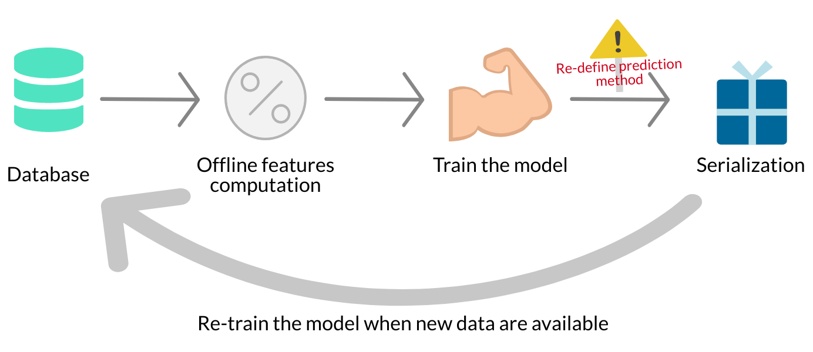
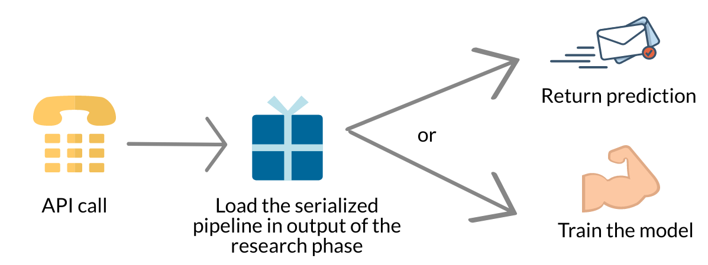

#### Introduction

Deploying and maintaining machine learning algorithms in a **production** environment is not an easy task. The **drift** of data over the time tends to degrade the performance of the algorithms because models are static. Data Scientist **re-train models from scratch** to update them. This task is tedious and monopolizes highly qualified human resources. 

**I would like to present a solution to these problems**. I will use online learning and the **[Creme](https://github.com/creme)** library (I am core developper of Creme) to overcome the difficulties of deploying a machine learning model in production. I will illustrate my point with data from the **[M5-Forecasting-Accuracy kaggle competition](https://www.kaggle.com/c/m5-forecasting-accuracy/)** which is well suited to the use case of Creme. 

My goal is not to develop a competitive model but to show the simplicity of an online learning model for an event-based dataset such as M5-Forecasting-Accuracy.

First of all, I would like to share with you the deployment process I follow when I need to deploy a machine learning algorithm such as the LightGBM model or scikit-learn models in a production environment for a task similar to the M5-Forecasting-Accuracy competition. 

I will then compare this process to **deploying a model** with the Creme and Chantilly libraries.

[Max Halford](https://maxhalford.github.io) is the main developper of Creme and he's the one who initiated the project, he did a blog post **[here](https://towardsdatascience.com/machine-learning-for-streaming-data-with-creme-dacf5fb469df)**. This is a good introduction to the philosophy of online learning and especially Creme philosophy. Feel free to have a look at it if you are interested in the subject. 

<p align="center">
    
</p>

<b>
    <p style="text-align:center">
        Photo by <a href="https://unsplash.com/s/photos/mats-speicher?utm_source=medium&utm_medium=referral"> Mats Speicher</a> on <a href="https://unsplash.com"> Unsplash </a>
    </p>
</b>

### Model deployment  when fitting data in one row:

Deploying a model that learns by batch requires a well-oiled organization. I describe here the process I followed to deploy this kind of algorithm in production. **I would like to point out that we all had different experiences with deploying algorithms in production.** You may not agree with all of the points I'm making. I invite you to share your view in the comments. 

**I distinguish two main steps in the organization of the project when deploying a machine learning algorithm in production:**

- The **prototyping phase** phase is dedicated to the selection of the algorithm and the selection of the features to solve the problem.


- The **engineering phase** phase is dedicated to the creation of robust machine learning systems. It aims at deploying the model in production, allows re-training the model on a regular basis.


#### Prototyping:

The first thing to do during the prototyping phase phase is to define a method for evaluating the quality of the model. **Which objective do you want to optimize?** You have to define a validation process now. Usually this is cross-validation. After defining the validation process, the whole point is to find the most suitable model with carefully selected hyperparameters. Without forgetting the feature engineering stage which is the key to most problems. 

The prototyping step is difficult and exciting. We rely on our expertise in the field concerned, our creativity and our scientific culture.

#### Engineering:

It seems interesting to me to choose to deploy the algorithm for predicting product sales behind an API. The API is a practical solution to allow the largest number of users and software to query the trained model. 

During the engineering phase I distinguish two sub-categories modules. The first one is dedicated to the training of the model and its serialization. I call the first set **Offline**. The second one is dedicated to the behavior of the model in the production environment. I call this second part **Online**. I call it "online" because, in my opinion, deploying the model behind an API is an interesting solution here. 

There is a lot of engineering work to ensure consistency between the offline training part and the online inference part. Any transformations that have been applied to the data during training must be applied to the data during the inference phase. This requires the development of code that is different from the training phase but which produces the same results.


The development phase should lead to the creation of different modules:

**Offline:**

- **module 1:** Script dedicated to the calculation of features for the model training. The feature computation should be vectorized to speed up the process.


- **module 2:** Script for training, and evaluating the model. The training of the model is based on the features computed by the module 1.


- **module 3:** Script dedicated to the serialization of the model. It is important to redefine the model prediction method before serializing the model. Libraries like Scikit-Learn do not develop models so that they can quickly make predictions for a single observation. You can find more information [here](https://maxhalford.github.io/blog/speeding-up-sklearn-single-predictions/). The [sklearn-onnx](https://github.com/onnx/sklearn-onnx) library is an interesting solution to this problem. I already used [treelite](https://github.com/dmlc/treelite) and this is suitable alternative for LightGBM.



**Online:**

- **module 4**: Script for calculating features for the production environment. Usually the predictions in the production environment are made via the call of an API. The feature calculation should not be vectorized because it is performed for a single observation when calling the API. As a result, the source code of module 4 differs from the source code of module 1.

**Deployment:**

- **Module 5**: API definition. When a call is made, the API must load the serialized model, calculate the features using module 4 and make a prediction. The model could also be loaded into memory at API startup.


**Tests:**

- It is strongly recommended to integrate multiple unit tests such as unit tests for offline feature computation and unit test for online feature calculation. Non regression test to ensure that the offline model produces the same results as the online model are necessary too.

**After deploying an algorithm in production, you will need to re-train the model regularly and maintain the architecture. Deploying a learning machine algorithm that learns by batch is tedious. It's a long-term project that requires a lot of rigor. Such a project represents a significant technological debt and monopolizes highly qualified human resources on a daily basis.**

### Model deployment with Creme and Chantilly

Creme is an online learning library. Creme allows to train machine learning models on data flows. 

Each Creme model has a ``fit_one`` method. **The ``fit_one`` method allows to update the model when there is a new observation available** for training. Similarly to neural networks, there is no need to re-train the model from scratch when new observations comes in.

Creme is not a suitable solution for Kaggle. Learning in batch allows the model to converge faster. **I won't choose Creme to get a medal on Kaggle. However, in everyday life, Creme is a viable and flexible solution for modeling a complex problem**.

In this kernel, I am going to make a tutorial to show how to deploy in production a Creme algorithm trained to predict the target of the M5-Forecasting-Accuracy competition. I'll use the library [Chantilly](https://github.com/creme-ml/chantilly) to deploy my solution in production. Chantilly is a library under development that allows you to easily deploy the models from Creme in production.

#### Prototyping

As usual, during the prototyping phase, I define the validation process and the metrics used to evaluate the quality of the model I develop. Online learning allow to do **progressive validation** which is the online counterpart of cross-validation. The progressive validation allows to take into account the temporality of the problem. For reasons of simplicity I chose to use the MAE metric to evaluate the quality of my model.


After a few tries on my side, **I chose to train a ``KNNRegressor`` model per product and per store** to predict the number of sales. It represent approximatively 30490 models. All the models provides correct results with the progressive validation method. When I predict the next day's sales for a given product and store the average MAE of my models is 0.98.

I chose to use as features for each model:

- Global mean

- Global variance

- Average sales for the last 1, 3, 7, 15, 30 days.

- Average of the sales of the realized according to the day, ie {Monday, Tuesday, ..Sunday} with a lag of 1, 3, 7, 15, 30 days.

#### Engineering

I'll start by installing the Creme library:

```bash
pip install creme
```

I'm importing the packages that I'm going to need:

```python
import copy
import datetime
import random
import tqdm
```

```python
from creme import compose
from creme import feature_extraction
from creme import neighbors
from creme import metrics
from creme import optim
from creme import preprocessing
from creme import stats
from creme import stream
```

I use this first function to parse the date and extract the number of the day.

```python
def extract_date(x):
    """Extract features from the date."""
    import datetime
    if not isinstance(x['date'], datetime.datetime):
        x['date'] = datetime.datetime.strptime(x['date'], '%Y-%m-%d')
    x['wday'] = x['date'].weekday()
    return x
```

``get_metadata`` allows you to extract the identifier of the product and the store.

```python
def get_metadata(x):
    key = x['id'].split('_')
    x['cat_id'] = f'{key[0]}'
    x['dept_id'] = f'{x["cat_id"]}_{key[1]}'
    x['item_id'] = f'{x["cat_id"]}_{x["dept_id"]}_{key[2]}'
    return x
```

Below I define the feature extraction pipeline. I use the module ``feature_extraction.TargetAgg`` to calculate the features on the target variable of the stream.

```python
extract_features = compose.TransformerUnion(
    compose.Select('wday'),
    
    feature_extraction.TargetAgg(by=['item_id'], how=stats.Mean()),
    feature_extraction.TargetAgg(by=['item_id'], how=stats.Var()),
    
    feature_extraction.TargetAgg(by=['item_id'], how=stats.RollingMean(1)),
    feature_extraction.TargetAgg(by=['item_id'], how=stats.RollingMean(30)),
    feature_extraction.TargetAgg(by=['item_id'], how=stats.RollingMean(15)),
    feature_extraction.TargetAgg(by=['item_id'], how=stats.RollingMean(7)),
    feature_extraction.TargetAgg(by=['item_id'], how=stats.RollingMean(3)),
    
    feature_extraction.TargetAgg(by=['wday'], how=stats.RollingMean(30)),
    feature_extraction.TargetAgg(by=['wday'], how=stats.RollingMean(15)),
    feature_extraction.TargetAgg(by=['wday'], how=stats.RollingMean(7)),
    feature_extraction.TargetAgg(by=['wday'], how=stats.RollingMean(3)),
    feature_extraction.TargetAgg(by=['wday'], how=stats.RollingMean(1)),
)
```

Below, I define the global pipeline I want to deploy in production. The pipeline is composed of:

- Extraction of the product identifier.

- Extraction of the day number of the date $\in$ {1, 2, ..7}. 

- Computation of the features.

- Standard scaler that centers and reduces the value of features.

- Model declaration ``neighbors.KNeighborsRegressor``.

```python
model = (
    compose.FuncTransformer(get_metadata) |
    compose.FuncTransformer(extract_date) |
    extract_features |
    preprocessing.StandardScaler() |
    neighbors.KNeighborsRegressor(window_size=30, n_neighbors=15)
)
```

I have chosen to create one template per product and per store. The piece of code below create a copy of the pipeline for all product/store pairs and store them in a dictionary.

```python
list_model = []

X_y = stream.iter_csv('./data/sample_submission.csv', target_name='F8')

for x, y in tqdm.tqdm(X_y, position=0):
    
    item_id = '_'.join(x['id'].split('_')[:5])
    
    if item_id not in list_model:
    
        list_model.append(item_id)
        
dic_models = {item_id: copy.deepcopy(model) for item_id in tqdm.tqdm(list_model, position=0)}
```

I make a warm-up of all the models from a subset of the training set. To do this pre-training, I selected the last two months of the training set and saved it in csv format.I use Creme's ``stream.iter_csv`` module to iterate on the training dataset. The pipeline below consumes very little RAM memory because we load the data into the memory one after the other.

```python
random.seed(42)

params = dict(
    target_name='y', 
    converters={
        'y': int, 
        'id': str,
    },
    parse_dates= {'date': '%Y-%m-%d'},
)

X_y = stream.iter_csv('./data/train.csv', **params)

bar = tqdm.tqdm(X_y, position = 0)

metric = metrics.Rolling(metrics.MAE(), 300000)

for i, (x, y) in enumerate(bar):
    
    item_id = '_'.join(x['id'].split('_')[:5])

    # Predict:
    y_pred = dic_models[item_id].predict_one(x)

    # Update the model:
    dic_models[item_id].fit_one(x=x, y=y)

    # Update the metric:
    metric = metric.update(y, y_pred)
    
    if i % 4000 == 0:

        # Update tqdm progress bar every 4000 iterations.
        bar.set_description(f'MAE: {metric.get():4f}')
```

#### Deployment of the model:

Now that all the models are pre-trained, I will be able to deploy the pipelines behind an API in a production environment. I will use the [Chantilly](https://github.com/creme-ml/chantilly) library to do so.

```bash
pip install git+https://github.com/creme-ml/chantilly`
```

After installing Chantilly, I start the chantilly instance with the bash command:

```bash
chantilly run
```

I'm going to associate the regression flavor with the Chantilly API. Chantilly uses this flavor to select the appropriate metrics (MAE, MSE and SMAPE). Finally, I deploy all my models in production. Each model is identifiable by its name which is composed of the product identifier and the store identifier.

```python
import requests

r = requests.post('http://localhost:5000/api/init', json= {'flavor': 'regression'})
```

After initializing the Chantilly API, I upload all the templates I've pre-trained. Each model has a name. This name is composed of the product and store ID. I use dill to serialize the model before uploading it to my API.

```python
import dill

for model_name, model in dic_models.items():
    
    r = requests.post('http://localhost:5000/api/model/{}'.format(model_name), data=dill.dumps(model))
    
```

All the models are now deployed in production and available to make predictions. The models can also be updated on a daily basis. That's it.



**As you may have noticed, the philosophy of online learning allows to reduce the complexity of the deployment of a machine learning algorithm in production. Moreover, to update the model, we only have to make calls to the API. We don't need to re-train the model from scratch.**

#### Make a prediction by calling the API:

```python
json = {
    'id': 1,
    'model': 'HOBBIES_1_001_CA_1',
    'features': {'date': '2020-04-30', 'id': 'HOBBIES_1_001_CA_1'}
}

r = requests.post('http://localhost:5000/api/predict', json=json)

prediction = r.json()
```

#### Update models with new data:

```python
r = requests.post('http://localhost:5000/api/learn', json={
    'id': 1,
    'model': 'HOBBIES_1_001_CA_1',
    'ground_truth': 2,
})
```

Feel free to visit the [Chantilly](https://github.com/creme-ml/chantilly) github  for more details on the API features.

--


Thank you for reading me. 

Raphaël Sourty, Creme developper.
